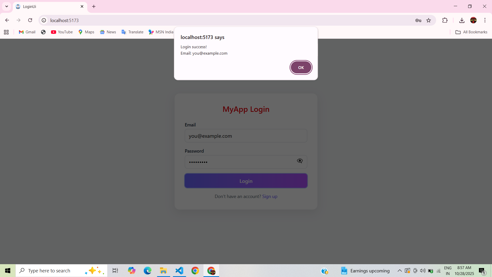

SignUp Login UI

Below are the screenshots of the output:

### 1. Signup Page
This screen allows the user to enter full name, email, password and confirm password.  
If both passwords do not match, an alert is shown.  
After successful signup, it redirects back to the login page.

### 2. Login Page
This screen shows the login form where the user can enter email and password.  
It also has a show/hide password option and a link to go to the signup page.

### 3. Login Alert Message
This screen shows the alert message when user enters correct email and password and click login button.  

## How to Run

1. Clone the repository  
   git clone https://github.com/Amoghbhat119/SignUP-Login-UI.git

2. Navigate into the folder  
   cd LoginUI

3. Install dependencies  
   npm install

4. Start the project  
   npm run dev

Then open the URL shown in the terminal (usually http://localhost:5173)

